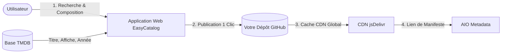

  <h1>🎬 EasyCatalog</h1>

  

    <strong>Le créateur moderne de catalogues de streaming pour AIO Metadata.</strong>
  

  

    Créez, organisez et hébergez vos propres catalogues de films et séries en quelques secondes. 
    Alimenté par <strong>TMDB</strong> et diffusé dans le monde entier à vitesse maximale via <strong>jsDelivr CDN</strong>.
  

  

    
  

  

    
    
    
  

  

    <a href="README.md">🇬🇧 Read this page in English</a>
  

---

## 🌟 Pourquoi EasyCatalog ? La force des catalogues statiques

S'il existe déjà d'excellentes solutions pour les **listes dynamiques** (tendances, populaires, automatisations par filtres), concevoir ses propres **collections statiques sur mesure** (sagas complètes, anthologies, filmographies d'un réalisateur, marathons thématiques) relevait jusqu'ici du parcours du combattant :

- ❌ **Quotas très stricts** : Des plateformes comme **Trakt** ou **MDBList** imposent des limites sévères sur le nombre de listes personnelles créées.
- ❌ **Fragiles et éphémères** : Utiliser des listes publiques tierces comporte le risque constant qu'elles soient modifiées, privatisées ou supprimées du jour au lendemain sans prévenir.
- ❌ **Corvée technique** : Écrire à la main des manifestes JSON complexes, récupérer les IDs et configurer des serveurs d'hébergement est long et fastidieux.

**EasyCatalog change complètement la donne :**
- ♾️ **Totalement illimité** : Créez autant de catalogues statiques personnalisés que vous le souhaitez, sans aucune restriction ni abonnement.
- 🛡️ **Propriété totale et permanente (À vie)** : Vos catalogues sont stockés directement sur **votre propre dépôt GitHub**. Personne d'autre ne peut les modifier ou les supprimer. Ils vous appartiennent à vie.
- ⚡ **Studio visuel intuitif** : Recherchez par titre, affiche et année, ajustez l'ordre en 1 clic et publiez instantanément.
- 🔗 **Conçu pour AIO Metadata** : Collez directement vos liens de manifestes dans **AIO Metadata**.

👉 **Accéder au service :** [https://easycatalog.vercel.app/](https://easycatalog.vercel.app/)

---

## ✨ Fonctionnalités principales

| Fonctionnalité | Description |
| :--- | :--- |
| **♾️ Illimité & Permanent** | Aucune restriction de nombre contrairement à Trakt ou MDBList. Vos catalogues restent à vie sur votre GitHub. |
| **🔍 Recherche TMDB en direct** | Recherche instantanée de films et séries par titre, affiche et année de sortie. Prêt à l'emploi sans rien configurer ! |
| **🐙 Connexion GitHub en 1 clic** | Authentification officielle et sécurisée par OAuth sans manipulation de jetons ni de clés compliquées. |
| **📁 Choix du dépôt de stockage** | Sélectionnez n'importe lequel de vos dépôts GitHub existants ou créez un dépôt dédié (ex: `nuvio-catalogs`) en un clic. |
| **🎛️ Studio Bureau (3 Colonnes)** | Interface pensée pour le confort : **Mes Catalogues** (gauche), **Recherche TMDB** (centre), **Éditeur en direct** (droite). |
| **📱 Interface Mobile Complète** | Navigation fluide et adaptée sur smartphones (iOS et Android) avec étapes guidées. |
| **🔗 Tout ajouter en un seul lien** | Regroupez l'ensemble de vos catalogues sous une seule URL pour tout importer dans AIO Metadata en un seul clic. |
| **⚡ CDN Mondial Gratuit** | Vos manifestes sont servis instantanément à travers le monde par le réseau de diffusion jsDelivr. |
| **🌍 Interface multilingue** | Disponible en 🇫🇷 Français, 🇬🇧 Anglais, 🇪🇸 Espagnol et 🇵🇹 Portugais. |
| **🔒 Respect des normes Stremio / Nuvio** | Séparation stricte films / séries garantissant une conformité totale avec les spécifications de lecture Stremio et Nuvio. |

---

## 📖 Comment l'utiliser ?

### 1. Se connecter avec GitHub
Ouvrez [easycatalog.vercel.app](https://easycatalog.vercel.app/) et cliquez sur **Se connecter avec GitHub**. Validez l'accès une seule fois. Dans les paramètres (⚙️), vous pouvez choisir un dépôt existant ou créer un nouveau dépôt dédié (par exemple `nuvio-catalogs`).

### 2. Composer votre catalogue
- Choisissez le mode **Films** ou **Séries**.
- Recherchez les œuvres qui vous intéressent et cliquez dessus pour les ajouter à votre liste.
- Réorganisez les éléments comme vous le souhaitez grâce au menu de tri (par année, alphabétique A-Z ou manuel).
- Donnez un nom clair à votre collection (ex: *L'univers Star Wars*, *Films Cultes Années 90*).

### 3. Publier et récupérer votre lien
- Cliquez sur **Publier**.
- Votre catalogue et son manifeste JSON sont immédiatement créés et enregistrés sur votre dépôt GitHub.
- Cliquez sur l'icône de copie pour récupérer l'URL de votre manifeste et collez-la dans **AIO Metadata**.

---

## 🔄 Fonctionnement technique

- **Propriété totale de vos données** : Vos catalogues vous appartiennent et sont stockés sur votre propre compte GitHub.
- **Disponibilité maximale** : Grâce à GitHub et jsDelivr, vos catalogues sont accessibles en permanence sans interruption de service.
- **Sécurité et vie privée** : L'authentification passe par le protocole sécurisé OAuth GitHub. Aucun mot de passe ni token n'est stocké sur des serveurs externes.

---

## ☕ Soutenir le projet

EasyCatalog est un projet indépendant et gratuit. Si le service vous est utile, vous pouvez soutenir son maintien et ses évolutions :

---

## 📄 Licence et mentions

Ce projet est sous licence [MIT](LICENSE).  
Cette application est un outil communautaire indépendant et n'est pas affiliée officiellement à Stremio, Nuvio ou TMDB.
