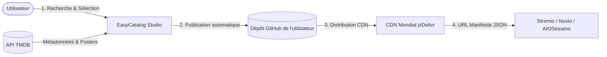

<div align="center">

  <h1>🎬 EasyCatalog</h1>

  <p>
    <strong>Le générateur moderne de catalogues de streaming pour AIO Metadata, Stremio et Nuvio.</strong>
  </p>

  <p>
    Créez, gérez et hébergez vos catalogues de films et séries personnalisés en quelques clics,<br />
    propulsés par <strong>TMDB</strong> et distribués mondialement à haute vitesse via <strong>GitHub</strong> et le CDN <strong>jsDelivr</strong>.
  </p>

  <p>
    <a href="https://github.com/Wayku-io/EasyCatalog/stargazers"></a>
    <a href="https://github.com/Wayku-io/EasyCatalog/network/members"></a>
    <a href="https://react.dev/"></a>
    <a href="https://vitejs.dev/"></a>
    <a href="https://vercel.com/"></a>
    <a href="https://buymeacoffee.com/wayku"></a>
  </p>

</div>

---

## 🌟 Pourquoi EasyCatalog ?

Avant EasyCatalog, créer des catalogues personnalisés pour **AIO Metadata** (AIOStreams), **Stremio** ou **Nuvio** nécessitait d'écrire des fichiers JSON à la main, de chercher manuellement les identifiants IMDb/TMDB, et de configurer des serveurs ou des hébergements complexes.

**EasyCatalog transforme ce processus en une expérience visuelle fluide et intuitive :**
- 🔍 Recherchez n'importe quel film ou série sur **TMDB**.
- ➕ Ajoutez-le à votre catalogue d'un simple clic.
- ⚡ Cliquez sur **Publier** : vos fichiers sont instantanément générés, versionnés sur GitHub et immédiatement disponibles via le CDN mondial jsDelivr.
- 🔗 Importez directement le manifeste dans **AIO Metadata** ou **Stremio**.

---

## ✨ Fonctionnalités Principales

| Fonctionnalité | Description |
| :--- | :--- |
| **🔍 Recherche TMDB en direct** | Recherche instantanée multi-langue de films et séries avec affiches haute résolution, notes, années de sortie et résumés. |
| **🐙 Connexion GitHub en 1 Clic** | Authentification officielle OAuth GitHub sans mot de passe : votre compte et votre dépôt de stockage sont configurés automatiquement. |
| **🎛️ Studio Dashboard PC (3 Panneaux)** | Interface de travail fixe sans scroll externe : **Mes Catalogues** à gauche, **Recherche TMDB** au centre, **Éditeur en direct** à droite. |
| **📱 Expérience Mobile Native** | Conçu pour une ergonomie parfaite sur smartphone (iOS / Android) avec menu fluide et bascule instantanée entre recherche et éditeur. |
| **📦 Super Manifeste ("Tout ajouter à AIO")** | Compilez tous vos catalogues en un seul clic dans un manifeste unifié pour installer l'intégralité de vos collections en une seule fois dans Stremio. |
| **🚀 Hébergement CDN jsDelivr** | Aucun serveur payant nécessaire : vos manifestes et catalogues sont servis mondialement avec mise en cache CDN ultra-rapide. |
| **🌍 Multi-langues** | Interface et métadonnées TMDB disponibles en 🇫🇷 Français, 🇬🇧 Anglais, 🇪🇸 Espagnol et 🇵🇹 Portugais. |
| **🔒 Séparation Stricte Films / Séries** | Verrouillage automatique du type de média pour garantir des manifestes 100 % conformes aux spécifications de l'API Stremio. |

---

## 🔄 Comment ça fonctionne ? (Architecture)



1. **Recherche** : L'application interroge l'API TMDB pour extraire les métadonnées officielles (titres, posters, résumés, identifiants).
2. **Assemblage** : Vous ordonnez et personnalisez votre collection dans l'éditeur interactif.
3. **Publication** : EasyCatalog crée l'arborescence complète `EasyCatalog/manifests/<votre-catalogue>/` sur votre dépôt GitHub via l'API REST de GitHub.
4. **Diffusion** : Le catalogue est servi instantanément via le réseau CDN gratuit jsDelivr (`https://cdn.jsdelivr.net/gh/<user>/<repo>/...`).
5. **Streaming** : Vous collez l'URL générée dans Stremio, Nuvio ou AIO Metadata !

---

## 🚀 Déploiement en 1 Clic sur Vercel (Recommandé)

EasyCatalog est optimisé pour être hébergé **gratuitement** sur **Vercel** avec l'offre Hobby.

### 1. Importer sur Vercel
1. Rendez-vous sur [vercel.com/new](https://vercel.com/new).
2. Sélectionnez le dépôt `Wayku-io/EasyCatalog` et cliquez sur **Import**.
3. Cliquez sur **Deploy**. En 30 secondes, votre site est en ligne avec une URL publique `https://votre-app.vercel.app`.

### 2. Activer la connexion officielle GitHub OAuth
1. Allez sur les paramètres GitHub : [github.com/settings/applications/new](https://github.com/settings/applications/new).
2. Remplissez :
   - **Application name** : `EasyCatalog`
   - **Homepage URL** : `https://votre-app.vercel.app`
   - **Authorization callback URL** : `https://votre-app.vercel.app/` *(avec le slash final)*
3. Cliquez sur **Register application**.
4. Copiez votre **Client ID** et générez votre **Client Secret**.
5. Dans Vercel, allez dans **Settings** > **Environment Variables** et ajoutez :
   - `VITE_GITHUB_CLIENT_ID` = `votre_client_id`
   - `GITHUB_CLIENT_SECRET` = `votre_client_secret`
6. Redéployez votre projet sur Vercel : **votre bouton de connexion en 1 clic est actif !**

---

## 💻 Développement Local

Si vous souhaitez exécuter EasyCatalog en local sur votre machine :

```bash
# 1. Cloner le dépôt
git clone https://github.com/Wayku-io/EasyCatalog.git
cd EasyCatalog

# 2. Installer les dépendances
npm install

# 3. (Optionnel) Configurer les variables d'environnement
cp .env.example .env
# Remplissez VITE_GITHUB_CLIENT_ID et GITHUB_CLIENT_SECRET pour tester l'OAuth en local

# 4. Démarrer le serveur de développement
npm run dev
```

L'application sera accessible sur `http://localhost:5173`.

---

## 📁 Structure du Projet

```text
EasyCatalog/
├── api/
│   └── auth.js             # Fonction Serverless Vercel (échange de token OAuth GitHub)
├── public/
│   ├── favicon.svg         # Favicon émeraude officiel
│   └── icons.svg           # Sprites et icônes
├── src/
│   ├── assets/             # Images et icônes statiques
│   ├── components/
│   │   ├── DesktopDashboard.jsx   # Studio 3 colonnes pour PC
│   │   ├── HubScreen.jsx          # Écran d'accueil mobile
│   │   ├── SearchScreen.jsx       # Écran de recherche mobile
│   │   ├── BuilderScreen.jsx      # Éditeur de catalogue mobile
│   │   ├── CollectionsScreen.jsx  # Gestionnaire de collections mobile
│   │   ├── ConfigModal.jsx        # Fenêtre de configuration & Connexion GitHub
│   │   ├── Header.jsx             # En-tête avec switch de langue & statut
│   │   └── Toast.jsx              # Système de notifications toast
│   ├── i18n/
│   │   ├── LanguageContext.jsx    # Gestionnaire de contexte de langue
│   │   └── translations.js        # Dictionnaires FR, EN, ES, PT
│   ├── services/
│   │   ├── github.js              # API GitHub (OAuth, commits, manifests, jsDelivr)
│   │   ├── tmdb.js                # API TheMovieDatabase (recherche, détails)
│   │   └── export.js              # Export JSON pour Stremio
│   ├── App.jsx                    # Point d'entrée principal & routage
│   ├── index.css                  # Thème Design Système (Vert Émeraude, Glassmorphism)
│   └── main.jsx                   # Montage React 19
├── vercel.json                    # Configuration de routage Vercel SPA + API
├── vite.config.js                 # Configuration Vite avec middleware dev OAuth
└── README.md                      # Documentation du projet
```

---

## ☕ Soutenir le Projet

Si vous appréciez EasyCatalog et souhaitez soutenir son développement continu :

<div align="center">
  <a href="https://buymeacoffee.com/wayku">
    
  </a>
</div>

---

## 📄 Licence

Ce projet est sous licence MIT — vous êtes libre de l'utiliser, le modifier et le distribuer.
Consultez le fichier `LICENSE` pour plus de détails.
