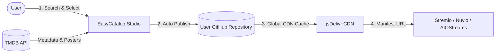

<div align="center">

  <h1>🎬 EasyCatalog</h1>

  <p>
    <strong>The modern streaming catalog builder for AIO Metadata, Stremio, and Nuvio.</strong>
  </p>

  <p>
    Create, organize, and host custom movie and TV series catalogs in just a few clicks.<br />
    Powered by <strong>TMDB</strong> and distributed worldwide at blazing speed via <strong>GitHub</strong> and <strong>jsDelivr CDN</strong>.
  </p>

  <p>
    <a href="README.fr.md">🇫🇷 <strong>Lire en Français</strong></a>
  </p>

  <p>
    <a href="https://github.com/Wayku-io/EasyCatalog/stargazers"></a>
    <a href="https://github.com/Wayku-io/EasyCatalog/network/members"></a>
    <a href="https://react.dev/"></a>
    <a href="https://vitejs.dev/"></a>
    <a href="https://vercel.com/"></a>
    <a href="https://buymeacoffee.com/wayku"></a>
  </p>

</div>

---

## 🌟 Why EasyCatalog?

Previously, creating custom catalogs for **AIO Metadata** (AIOStreams), **Stremio**, or **Nuvio** required writing complex JSON files manually, looking up IMDb/TMDB IDs one by one, and configuring custom hosting solutions.

**EasyCatalog streamlines this into an intuitive, visual experience:**
- 🔍 Search any movie or TV series on **TMDB**.
- ➕ Add titles to your collection with a single click.
- ⚡ Click **Publish**: your catalogs and manifests are generated, versioned on your GitHub repo, and immediately cached worldwide via jsDelivr CDN.
- 🔗 Add your custom manifest URL directly into **Stremio**, **Nuvio**, or **AIO Metadata**.

---

## ✨ Key Features

| Feature | Description |
| :--- | :--- |
| **🔍 Live TMDB Search** | Multi-language instant search for movies & series with HD posters, release dates, ratings, and synopses. |
| **🐙 1-Click GitHub Connect** | Official OAuth authorization without tokens or passwords: automatically creates and links your storage repository. |
| **🎛️ Desktop Studio Dashboard (3 Panels)** | Zero external scroll interface: **My Collections** (left), **TMDB Search** (center), **Live Editor** (right). |
| **📱 Native Mobile Experience** | Full responsive support on iOS & Android with fast drawer navigation and QR code local testing. |
| **📦 Super Manifest ("Add All to AIO")** | Bundle all your catalogs together in a single unified manifest to import your entire collection in one tap. |
| **🚀 Free Global CDN (jsDelivr)** | Zero server costs: your manifests are served instantly worldwide with aggressive CDN caching. |
| **🌍 Multi-language** | UI and TMDB metadata available in 🇫🇷 French, 🇬🇧 English, 🇪🇸 Spanish, and 🇵🇹 Portuguese. |
| **🔒 Strict Type Separation** | Automatic movie/series locking to guarantee 100% compliance with Stremio Addon specifications. |

---

## 🔄 Architecture & Data Flow



---

## 🚀 1-Click Deployment on Vercel (Recommended)

EasyCatalog is optimized for **free hosting** on **Vercel** (Hobby Plan).

### 1. Import to Vercel
1. Visit [vercel.com/new](https://vercel.com/new).
2. Select repository `Wayku-io/EasyCatalog` and click **Import**.
3. Click **Deploy**. Within 30 seconds, your site will be live at `https://your-app.vercel.app`.

### 2. Configure 1-Click GitHub OAuth
1. Go to GitHub Developer Settings: [github.com/settings/applications/new](https://github.com/settings/applications/new).
2. Fill in:
   - **Application name**: `EasyCatalog`
   - **Homepage URL**: `https://your-app.vercel.app`
   - **Authorization callback URL**: `https://your-app.vercel.app/` *(include trailing slash)*
3. Click **Register application**.
4. Copy your **Client ID** and generate a **Client Secret**.
5. In your Vercel project, go to **Settings** > **Environment Variables** and add:
   - `VITE_GITHUB_CLIENT_ID` = `your_client_id`
   - `GITHUB_CLIENT_SECRET` = `your_client_secret`
   - `VITE_TMDB_API_KEY` = `your_tmdb_api_key` *(optional default key for all users)*
6. Redeploy your project on Vercel: **your app is fully operational with zero configuration needed for end-users!**

---

## 💻 Local Development

```bash
# 1. Clone the repository
git clone https://github.com/Wayku-io/EasyCatalog.git
cd EasyCatalog

# 2. Install dependencies
npm install

# 3. Setup environment variables (optional)
cp .env.example .env

# 4. Start Vite dev server
npm run dev
```

App will run at `http://localhost:5173`.

---

## ☕ Support the Project

If you find EasyCatalog useful, consider buying me a coffee:

<div align="center">
  <a href="https://buymeacoffee.com/wayku">
    
  </a>
</div>

---

## ⚖️ Legal & Privacy

- Review [LEGAL.md](LEGAL.md) for Vercel hosting details, GDPR compliance (zero trackers, 100% local storage), required TMDB attributions, and copyright disclaimers (zero video files hosted).

---

## 📄 License

This project is licensed under the MIT License - see the `LICENSE` file for details.
