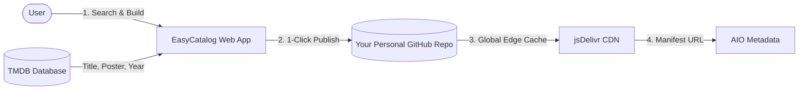

  <h1>🎬 EasyCatalog</h1>

  

    <strong>The modern streaming catalog builder for AIO Metadata.</strong>
  

  

    Create, organize, and host custom movie and TV series catalogs in seconds. 
    Powered by <strong>TMDB</strong> and delivered worldwide at blazing speed via <strong>jsDelivr CDN</strong>.
  

  

    
  

  

    
    
    
  

  

    <a href="README.fr.md">🇫🇷 Lire cette page en Français</a>
  

---

## 🌟 Why EasyCatalog? The Power of Static Catalogs

While excellent solutions already exist for **dynamic lists** (trending, popular, automated filters), creating your own **curated static collections** (franchises, director filmographies, thematic marathons, personal favorites) has always been frustrating:

- ❌ **Strict Limits**: Platforms like **Trakt** or **MDBList** impose heavy quota restrictions on the number of personal lists you can create.
- ❌ **Fragile & Ephemeral**: Relying on third-party public lists is risky—creators can alter, privatize, or delete them overnight without warning.
- ❌ **Technical Barrier**: Writing raw JSON manifests by hand, resolving IDs, and configuring server hosting is tedious.

**EasyCatalog solves this by putting you in total control:**
- ♾️ **Truly Unlimited**: Build as many custom static catalogs as you want, with zero artificial caps or subscriptions.
- 🛡️ **100% Owned & Permanent (A vie)**: Every catalog is stored directly on **your own GitHub repository**. No third-party can take them down or alter them. They belong to you forever.
- ⚡ **Effortless Visual Studio**: Search by title, poster, and release year, arrange orders with 1-click sorting, and publish instantly.
- 🔗 **Built for AIO Metadata**: Copy your generated manifest link directly into **AIO Metadata**.

👉 **Launch EasyCatalog now:** [https://easycatalog.vercel.app/](https://easycatalog.vercel.app/)

---

## ✨ Features

| Feature | Description |
| :--- | :--- |
| **♾️ Unlimited & Permanent** | No list limits unlike Trakt or MDBList. Your catalogs live permanently on your personal GitHub repo. |
| **🔍 Live TMDB Search** | Search movies and series by title, poster, and release year. Ready to use with zero setup! |
| **🐙 1-Click GitHub Connect** | Connect your GitHub account securely via official OAuth without manual tokens or complex setup. |
| **📁 Dedicated Storage Choice** | Select any of your existing GitHub repositories or create a dedicated one (e.g. `nuvio-catalogs`) in 1 click. |
| **🎛️ Desktop Studio Dashboard** | 3-column layout built for productivity: **My Collections** (left), **TMDB Search** (center), and **Live Editor** (right). |
| **📱 Full Mobile Support** | Responsive interface on iOS & Android with smooth step-by-step navigation. |
| **🔗 Add All in One Link** | Group all your catalogs under a single unified link to import everything into AIO Metadata in one click. |
| **⚡ Global CDN Delivery** | Zero server maintenance: catalogs are served worldwide through jsDelivr's high-speed CDN. |
| **🌍 Multi-language UI** | Available in 🇬🇧 English, 🇫🇷 French, 🇪🇸 Spanish, and 🇵🇹 Portuguese. |
| **🔒 Stremio / Nuvio Standard Compliance** | Strict movie/series type separation ensuring 100% compliance with Stremio and Nuvio player specifications. |

---

## 📖 How to Use

### 1. Connect with GitHub
Open [easycatalog.vercel.app](https://easycatalog.vercel.app/) and click **Connect with GitHub**. Authenticate once to link your account. In the settings (⚙️), you can select an existing repository or create a dedicated one (like `nuvio-catalogs`).

### 2. Search & Compose Your Catalog
- Choose **Movies** or **Series** mode.
- Search for the titles you want and click an item to add it to your list.
- Reorder titles manually or use the quick-sort dropdown (by release year, alphabetical A-Z).
- Enter a clear name for your collection (e.g. *Christopher Nolan Essentials*, *Best Sci-Fi 90s*).

### 3. Publish & Add via Quick Add
- Click **Publish**.
- Your catalog and JSON manifest are instantly created and pushed to your repository.
- Click the copy icon to copy your manifest URL, then in **AIO Metadata**, simply click the **Quick Add** button (`🔗 Quick Add`) and paste your link. That's it!

---

## 🔄 How it Works

- **Full Data Ownership**: Your catalogs belong entirely to you and live on your personal GitHub account.
- **High Availability**: Thanks to GitHub and the jsDelivr CDN, your catalogs are available 24/7 with 99.9% uptime.
- **Privacy & Security**: Authentication is handled through GitHub OAuth. No access tokens or personal passwords are saved on external servers.

---

## ☕ Support the Project

EasyCatalog is free and open-source. If you enjoy using it, you can support development and maintenance:

---

## 📄 License & Legal

Distributed under the [MIT License](LICENSE).  
This application is an independent community tool and is not officially affiliated with Stremio, Nuvio, or TMDB.
