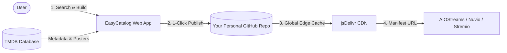

  <h1>🎬 EasyCatalog</h1>

  

    <strong>The modern streaming catalog builder for AIOStreams, Nuvio, and Stremio.</strong>
  

  

    Create, organize, and host custom movie and TV series catalogs in seconds. 
    Powered by <strong>TMDB</strong> and delivered worldwide at blazing speed via <strong>jsDelivr CDN</strong>.
  

  

    
  

  

    
    
    
  

  

    <a href="README.fr.md">🇫🇷 Lire cette page en Français</a>
  

---

## 🌟 What is EasyCatalog?

**EasyCatalog** is a free visual studio designed to make creating custom streaming catalogs effortless. 

Previously, creating custom catalogs for **AIO Metadata (AIOStreams)**, **Nuvio**, or **Stremio** required writing complex JSON files by hand, finding IMDb/TMDB IDs individually, and hosting files on servers.

**EasyCatalog automates the entire process into a clean 1-click web interface:**
- 🔍 **Search** any movie or TV series with live posters and details.
- 🎨 **Build & Organize** your custom lists with sorting and reordering tools.
- 🚀 **Publish in 1 Click**: Manifests and catalogs are generated directly on your own GitHub account and served via ultra-fast global CDN caching.
- 🔗 **Add to your player**: Simply copy your manifest link into AIOStreams, Nuvio, or Stremio.

👉 **Launch EasyCatalog now:** [https://easycatalog.vercel.app/](https://easycatalog.vercel.app/)

---

## ✨ Features

| Feature | Description |
| :--- | :--- |
| **🔍 Live TMDB Search** | Search millions of movies and series instantly with posters, release dates, and synopses. No configuration needed! |
| **🐙 1-Click GitHub Connect** | Connect your GitHub account securely via official OAuth without manual tokens or complex setup. |
| **📁 Dedicated Storage Choice** | Select any of your existing GitHub repositories or create a dedicated one (e.g. `nuvio-catalogs`) in 1 click. |
| **🎛️ Desktop Studio Dashboard** | 3-column layout built for productivity: **My Collections** (left), **TMDB Search** (center), and **Live Editor** (right). |
| **📱 Full Mobile Support** | Responsive interface on iOS & Android with smooth step-by-step navigation. |
| **📦 All-In-One Pack ("Super Manifest")** | Compile all your individual catalogs into a single unified manifest link to import your entire library at once. |
| **⚡ Global CDN Delivery** | Zero server maintenance: catalogs are served worldwide through jsDelivr's high-speed CDN. |
| **🌍 Multi-language UI** | Available in 🇬🇧 English, 🇫🇷 French, 🇪🇸 Spanish, and 🇵🇹 Portuguese. |
| **🔒 Stremio Addon Compliant** | Strict type management ensuring 100% compliance with Stremio and AIOStreams manifest standards. |

---

## 📖 How to Use

### 1. Connect with GitHub
Open [easycatalog.vercel.app](https://easycatalog.vercel.app/) and click **Connect with GitHub**. Authenticate once to link your account. You can pick an existing repository or create a dedicated one (like `nuvio-catalogs`) right from the settings.

### 2. Search & Compose Your Catalog
- Choose **Movies** or **Series** mode.
- Search for the titles you want and click an item to add it to your list.
- Reorder titles manually or use the quick-sort dropdown (by release year, alphabetical A-Z).
- Enter a clear name for your collection (e.g. *Christopher Nolan Essentials*, *Best Sci-Fi 90s*).

### 3. Publish & Copy Your Link
- Click **Publish**.
- Your catalog and JSON manifest are instantly created and pushed to your repository.
- Click **Copy Link** to grab your CDN manifest URL and paste it into **AIOStreams** or **Nuvio**.

---

## 🔄 How it Works

- **Full Data Ownership**: Your catalogs belong entirely to you and live on your personal GitHub account.
- **High Availability**: Thanks to GitHub and the jsDelivr CDN, your catalogs are available 24/7 with 99.9% uptime.
- **Privacy & Security**: Authentication is handled through GitHub OAuth. No access tokens or personal passwords are saved on external servers.

---

## ☕ Support the Project

EasyCatalog is free and open-source. If you enjoy using it, you can support development and maintenance:

---

## 📄 License & Legal

Distributed under the [MIT License](LICENSE).  
This application is an independent community tool and is not officially affiliated with Stremio, Nuvio, AIOStreams, or TMDB.
